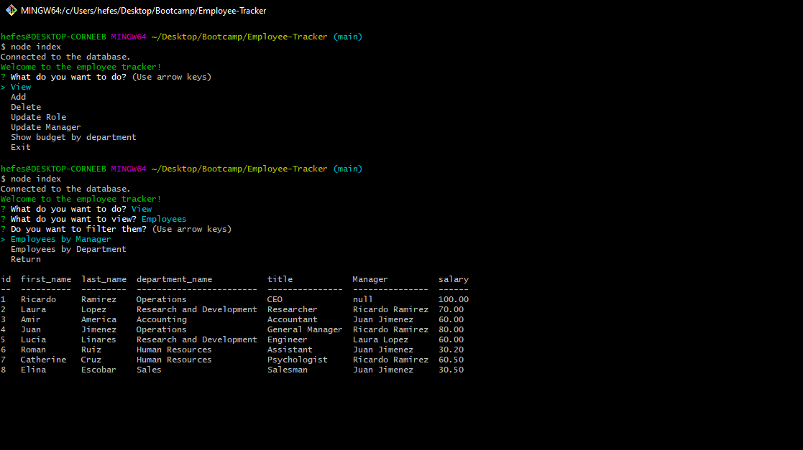

# Employee Tracker 

  ## Description
  
  
This is an application to manage a company's employees using a content management system (CMS) built with Inquirer in Node.js using MySQL for the database. It is a command-line app so it uses console.table to show the data. It allows to view, add and delete employees, roles and departments. It also has a few other utilites as updating roles and manager, filter employees by manager and department, and view budget for department.

  
  ## Table of Contents
  
  - [Installation](#installation)
  - [Usage](#usage)
  - [License](#license)
  - [Contributing](#license)
  - [Tests](#license)
  - [Questions](#license)
  
  ## Installation
  
  
- Download Files - Install dependencies - Start database by running the sql files "source ./db/schema.sql" "source ./db/seed.sql" "source ./db/query.sql"

  
  ## Usage
  
  
Run node index.js in the terminal where the file is located. Then use the key arrows to interact with the menus.

  
  

  
  ## License
  
  
Copyright (c) 2022, Cesar Sanchez All rights reserved.
Licensed under the MIT license. 

  
  
[License](./MIT_license.txt)

  
  ## How to Contribute
  
  
More utilities for updating the data is needed

  
  ## Tests
  
  
Open the video to see the app working or follow the instructions for installation and usage to test it.

  
  ## Questions
  
  If you have any question feel free to check my Github 
  
Username:csancheze
  
[Github](https://github.com/csancheze)

  or send me and email
  
<cesanchezesc@gmail.com>

